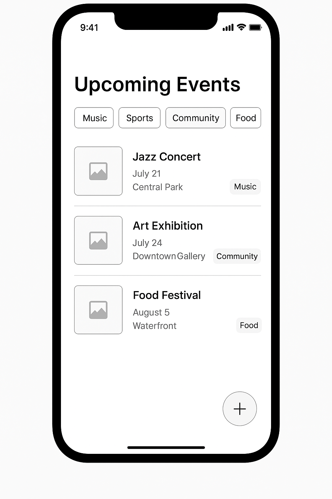

#  Local Event Tracker  

This is a simple mobile app that lets users keep track of local events happening around them. The app is designed in Figma and implements full **CRUD operations** (Create, Read, Update, Delete) for managing events.  

---

##  What the App Does (CRUD)  

- **Create:** Users can add new events by filling out a form with a title, date & time, location, category, and description.

- **Read:** All upcoming events are displayed on the home screen in a card/list format. Users can tap an event to see more details.

- **Update:** Users who created an event can edit its details through an “Edit” button in the event detail screen.

- **Delete:** Users can delete their own events either from the event detail view or directly from the event list.  

---

##  Features  

- **Event Feed:** A scrollable list of all upcoming events with filters (like Music, Sports, Community, Food).  
- **Event Details:** A page that shows the event’s title, date, time, location, and description.  
- **Add/Edit Event:** A form to create or update event info.  
- **My Events:** A page that shows all the events created/bookmarked by the user.   
